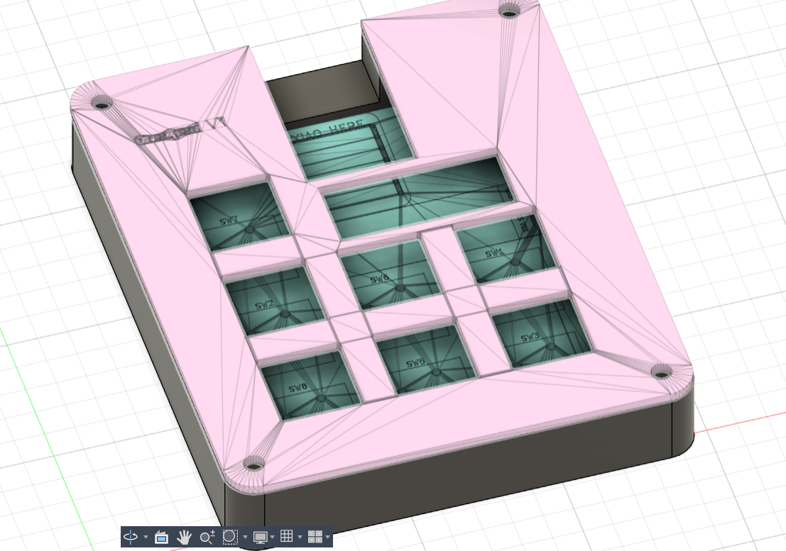
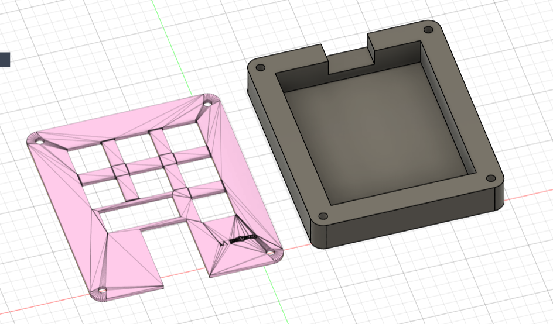
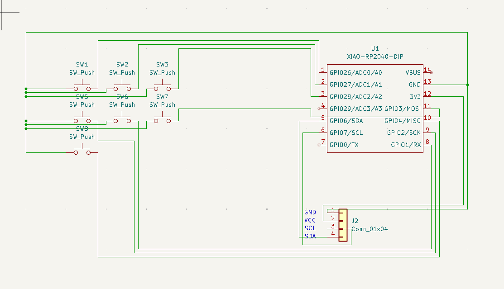
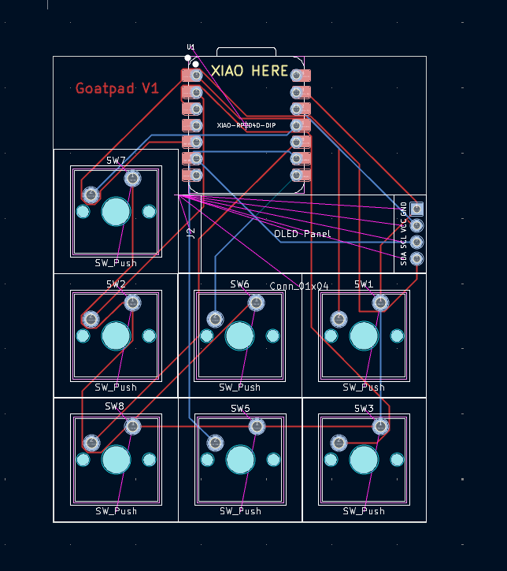

# GoatPad V1

This is my macro pad designed for gaming and fun shortcuts. It has 7 keys and an oled screen. I plan to use this for lots more than intially coded, but I'm happy with what I have now.

---

## 📸 Images

### Full Board (Top View)

### 3D Model Render

### Schematic

### PCB Layout

---

## 📦 Bill of Materials (BOM)

| Item | Qty | Description 
|------|-----|-------------|
| Seeed Studio Xiao RP2040 | 1 | Main microcontroller module |
| 0.91" OLED Display | 1 | I²C OLED module |
| Cherry MX‑Style Switches | 7 | Mechanical key switches |
---
